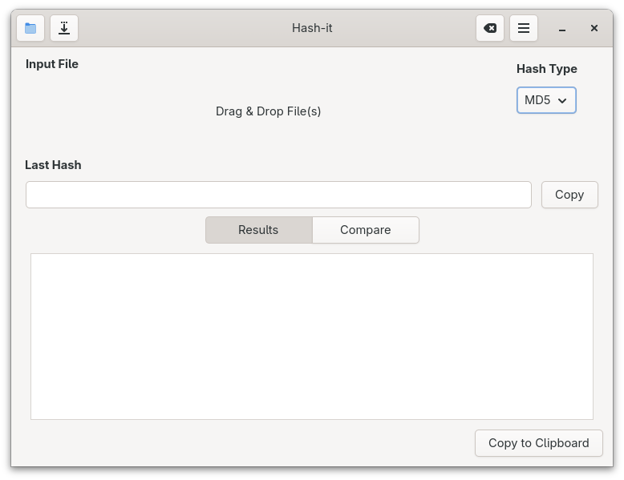

# Hash-it

[](https://opensource.org/licenses/GPL-3.0)
[](https://github.com/libredeb/hash-it/actions)
[](https://wiki.gnome.org/Projects/Vala)


**The most intuitive and simple hash tool checker for [elementary OS](https://elementary.io)**

Hashit is a fast and beautiful hash check tool. Writen in Vala and GTK+ 4.0 with the purpose to get the hash of file and compare it with other provided hash.



## Compilation

   1. Install dependencies:
   * For Ubuntu:
      ```sh
      sudo apt-get install cmake meson ninja-build valac libvala-*-dev libglib2.0-dev libgtk-4-dev libgranite-7-dev libadwaita-1-dev python3 python3-wheel python3-setuptools
      ```
   * For Fedora:
      ```sh
      sudo dnf install cmake meson ninja-build vala libvala-devel glib-devel gtk4-devel granite-7-devel libadwaita-devel python3 python3-wheel python3-setuptools gnome-menus
      ```
   * For Arch Linux:
      ```sh
      sudo pacman -Sy meson ninja vala glib2 gdk-pixbuf2 gtk4 granite7 libadwaita-1 python python-wheel python-setuptools
      ```
   2. Clone this repository into your machine
      ```sh
      git clone https://github.com/libredeb/hash-it.git
      cd hash-it/
      ```
   3. Create a build folder:
      ```sh
      meson setup build --prefix=/usr
      ```
   4. Compile hash-it:
      ```sh
      cd build
      ninja
      ```
   5. Install hash-it in the system:
      ```sh
      sudo ninja install
      ```
   6. (OPTIONAL) Uninstall hash-it:
      ```sh
      sudo ninja uninstall
      ```

## Developer Section

### Translations

To generate a new translation template file (a.k.a. `pot`) run next command:
```sh
cd build
ninja com.github.libredeb.hashit-pot
```

And for generate each LINGUA `po` file, run next command:
```sh
ninja com.github.libredeb.hashit-update-po
```

## License

This project is licensed under the GNU General Public License v3.0 or later - see the [COPYING](COPYING) file for details.

⭐ If you like Hash-it, leave me a star on GitHub!
